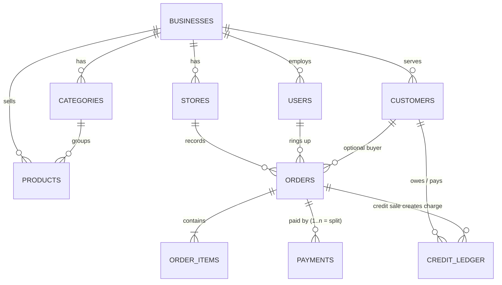

# Agricope POS — System Design

**Stack:** React (frontend, you) · Node.js REST API (backend, your colleague) · PostgreSQL
**Confirmed scope:** multi-tenant POS for stores and restaurants. Cash, card, online, credit, and split payments. Customer credit (money owed) tracking. Receipts (thermal print + shareable e-receipt link), barcode scanning, shifts & cash-drawer management, discounts with approvals, daily dashboard & reports. Restaurant operations: tables & open tabs, split/merge bills, service charge, per-order-type pricing, kitchen tickets & kitchen display screen.
**Deliberately not in scope yet:** stock management, product modifiers, offline mode, Arabic/RTL, loyalty, payment-gateway integration — all listed in section 15 with the hooks that make them easy to add later.

Sections 1–8 are the core system; sections 9–14 are the confirmed feature expansion. The build order lives in two companion docs: **frontend-workflow.md** (you) and **backend-workflow.md** (your colleague).

---

## 1. The big picture

```
┌─────────────────────┐        HTTPS / JSON        ┌──────────────────┐       ┌──────────────┐
│  React SPA           │  ◄──────────────────────► │  Node.js API      │ ◄───► │  PostgreSQL  │
│  (browser, per till) │      REST + JWT auth       │  (Express/NestJS) │       │              │
└─────────────────────┘                            └──────────────────┘       └──────────────┘
```

The frontend is a single-page React app that runs in the browser on each till/counter. It never talks to the database directly — everything goes through your colleague's API. This is the boundary between your work and hers, so the most important artifact you two share is the **API contract** (section 5): if you both agree on the exact URLs and JSON shapes early, you can build in parallel without waiting on each other.

**How to work in parallel:** have her write an OpenAPI (Swagger) spec first — even a rough one. You then use [MSW (Mock Service Worker)](https://mswjs.io/) in the React app to fake the API responses while she builds the real thing. When her endpoints are ready, you switch off the mocks and everything should just work.

---

## 2. Multi-tenancy: one system, many businesses

Since this is a product you'll offer to many businesses, every business (a "tenant") needs its data kept strictly separate. There are three common ways to do this:

| Approach | How | Verdict for v1 |
|---|---|---|
| **Shared tables + `business_id` column** | Every table has a `business_id`; every query filters by it | ✅ **Use this.** Simplest to build and operate |
| Schema per tenant | Each business gets its own set of tables | Overkill now; painful migrations |
| Database per tenant | Each business gets its own DB | Only needed at big scale / strict compliance |

Rules that make the shared-table approach safe:

1. **Every tenant-owned table carries `business_id`.** (Child tables like `order_items` inherit it through their parent order.)
2. The `business_id` **never comes from the frontend.** It's baked into the user's login token (JWT), and the API reads it from there. A malicious user editing requests in their browser can't reach another business's data because the server ignores anything the client says about which business it belongs to.
3. As a safety net, the backend can enable **PostgreSQL Row-Level Security (RLS)** later — the database itself then refuses to return rows from the wrong tenant even if a query forgets the filter.

---

## 3. Database schema

Conventions used below, and why:

- **IDs are UUIDs** (`gen_random_uuid()`). They don't leak information ("order 000041" tells a customer you've had 41 orders) and they make merging/syncing data later much easier.
- **Money is `NUMERIC(12,2)`, never `FLOAT`.** Floating-point math produces errors like `0.1 + 0.2 = 0.30000000000000004` — unacceptable when counting money.
- **Sales data is written as a snapshot.** When a product is sold, its name and price are *copied into* the order line. If you rename or reprice the product next month, old receipts must not change.
- Nothing that was sold is ever hard-deleted; products get `is_active = false` (a "soft delete") so history stays intact.
- Sections 9–14 extend these tables with `ALTER TABLE` statements — written as migration deltas on purpose, because that's exactly how your colleague will apply them to the database.

### Entity overview



### Tables

```sql
-- The tenant: one row per business that buys your product
CREATE TABLE businesses (
  id            UUID PRIMARY KEY DEFAULT gen_random_uuid(),
  name          TEXT NOT NULL,
  currency      CHAR(3) NOT NULL DEFAULT 'QAR',
  settings      JSONB NOT NULL DEFAULT '{}',   -- receipt footer, tax display, etc.
  created_at    TIMESTAMPTZ NOT NULL DEFAULT now()
);

-- A physical outlet: a shop, a restaurant branch, a kiosk
CREATE TABLE stores (
  id            UUID PRIMARY KEY DEFAULT gen_random_uuid(),
  business_id   UUID NOT NULL REFERENCES businesses(id),
  name          TEXT NOT NULL,
  type          TEXT NOT NULL CHECK (type IN ('retail','restaurant')),
  address       TEXT,
  is_active     BOOLEAN NOT NULL DEFAULT true
);

-- Staff logins
CREATE TABLE users (
  id            UUID PRIMARY KEY DEFAULT gen_random_uuid(),
  business_id   UUID NOT NULL REFERENCES businesses(id),
  store_id      UUID REFERENCES stores(id),    -- NULL = works across all stores (e.g. owner)
  name          TEXT NOT NULL,
  email         TEXT NOT NULL,
  password_hash TEXT NOT NULL,                 -- bcrypt/argon2, never plain text
  pin           TEXT,                          -- short PIN for fast cashier switching on a till
  role          TEXT NOT NULL CHECK (role IN ('owner','manager','cashier')),
  is_active     BOOLEAN NOT NULL DEFAULT true,
  UNIQUE (business_id, email)
);

CREATE TABLE categories (
  id            UUID PRIMARY KEY DEFAULT gen_random_uuid(),
  business_id   UUID NOT NULL REFERENCES businesses(id),
  name          TEXT NOT NULL,
  sort_order    INT NOT NULL DEFAULT 0
);

-- What's on sale. Note: NO stock/quantity columns — inventory arrives later
-- as separate tables (see section 7) without touching this one.
CREATE TABLE products (
  id            UUID PRIMARY KEY DEFAULT gen_random_uuid(),
  business_id   UUID NOT NULL REFERENCES businesses(id),
  category_id   UUID REFERENCES categories(id),
  name          TEXT NOT NULL,
  barcode       TEXT,                          -- scan-ready for retail
  price         NUMERIC(12,2) NOT NULL,
  tax_rate      NUMERIC(5,2) NOT NULL DEFAULT 0,  -- % ; Qatar has no VAT today, but tenants elsewhere will
  is_active     BOOLEAN NOT NULL DEFAULT true
);

-- Customers only matter when the business wants to track them —
-- essential for credit sales, useful for loyalty later.
CREATE TABLE customers (
  id            UUID PRIMARY KEY DEFAULT gen_random_uuid(),
  business_id   UUID NOT NULL REFERENCES businesses(id),
  name          TEXT NOT NULL,
  phone         TEXT,
  email         TEXT,
  credit_limit  NUMERIC(12,2),                 -- NULL = no credit allowed for this customer
  notes         TEXT,
  is_active     BOOLEAN NOT NULL DEFAULT true
);

CREATE TABLE orders (
  id             UUID PRIMARY KEY DEFAULT gen_random_uuid(),
  business_id    UUID NOT NULL REFERENCES businesses(id),
  store_id       UUID NOT NULL REFERENCES stores(id),
  order_number   TEXT NOT NULL,                -- human-friendly, e.g. 'S1-20260819-0042'
  cashier_id     UUID NOT NULL REFERENCES users(id),
  customer_id    UUID REFERENCES customers(id),-- required only for credit sales
  status         TEXT NOT NULL DEFAULT 'open'
                 CHECK (status IN ('open','completed','void','refunded')),
  order_type     TEXT CHECK (order_type IN ('counter','dine_in','takeaway','delivery')),
  subtotal       NUMERIC(12,2) NOT NULL DEFAULT 0,
  discount_total NUMERIC(12,2) NOT NULL DEFAULT 0,
  tax_total      NUMERIC(12,2) NOT NULL DEFAULT 0,
  total          NUMERIC(12,2) NOT NULL DEFAULT 0,
  note           TEXT,
  created_at     TIMESTAMPTZ NOT NULL DEFAULT now(),
  completed_at   TIMESTAMPTZ,
  UNIQUE (business_id, order_number)
);

-- Snapshot lines: name & price are COPIED here at sale time on purpose
CREATE TABLE order_items (
  id            UUID PRIMARY KEY DEFAULT gen_random_uuid(),
  order_id      UUID NOT NULL REFERENCES orders(id),
  product_id    UUID NOT NULL REFERENCES products(id),
  product_name  TEXT NOT NULL,                 -- snapshot
  unit_price    NUMERIC(12,2) NOT NULL,        -- snapshot
  quantity      NUMERIC(10,3) NOT NULL,        -- 3 decimals allows weighed goods (1.250 kg)
  discount      NUMERIC(12,2) NOT NULL DEFAULT 0,
  tax_rate      NUMERIC(5,2) NOT NULL DEFAULT 0,  -- snapshot
  line_total    NUMERIC(12,2) NOT NULL
);

-- One row per payment. A split payment is simply 2+ rows on the same order.
CREATE TABLE payments (
  id            UUID PRIMARY KEY DEFAULT gen_random_uuid(),
  business_id   UUID NOT NULL REFERENCES businesses(id),
  order_id      UUID NOT NULL REFERENCES orders(id),
  method        TEXT NOT NULL CHECK (method IN ('cash','card','online','credit')),
  amount        NUMERIC(12,2) NOT NULL,        -- negative amount = refund
  tendered      NUMERIC(12,2),                 -- cash only: what the customer handed over
  change_given  NUMERIC(12,2),                 -- cash only
  reference     TEXT,                          -- card last-4, bank transfer ref, gateway ref
  received_by   UUID NOT NULL REFERENCES users(id),
  created_at    TIMESTAMPTZ NOT NULL DEFAULT now()
);

-- The heart of credit management: an append-only ledger.
-- The customer's balance is the SUM of their entries — never a column you
-- update in place, so the history always explains the number.
CREATE TABLE credit_ledger (
  id            UUID PRIMARY KEY DEFAULT gen_random_uuid(),
  business_id   UUID NOT NULL REFERENCES businesses(id),
  customer_id   UUID NOT NULL REFERENCES customers(id),
  entry_type    TEXT NOT NULL CHECK (entry_type IN ('charge','repayment','adjustment')),
  amount        NUMERIC(12,2) NOT NULL,        -- charge: +ve (they owe more); repayment: -ve
  order_id      UUID REFERENCES orders(id),    -- set on 'charge' entries
  method        TEXT CHECK (method IN ('cash','card','online')),  -- set on 'repayment' entries
  note          TEXT,
  created_by    UUID NOT NULL REFERENCES users(id),
  created_at    TIMESTAMPTZ NOT NULL DEFAULT now()
);

-- Who did what, when — voids, discounts, price changes, logins
CREATE TABLE audit_log (
  id            BIGSERIAL PRIMARY KEY,
  business_id   UUID NOT NULL REFERENCES businesses(id),
  user_id       UUID REFERENCES users(id),
  action        TEXT NOT NULL,                 -- 'order.void', 'product.price_change', ...
  entity        TEXT,
  entity_id     UUID,
  details       JSONB,
  created_at    TIMESTAMPTZ NOT NULL DEFAULT now()
);

-- Indexes the API will lean on constantly
CREATE INDEX idx_orders_store_date  ON orders (business_id, store_id, created_at);
CREATE INDEX idx_payments_order     ON payments (order_id);
CREATE INDEX idx_ledger_customer    ON credit_ledger (business_id, customer_id, created_at);
CREATE INDEX idx_products_business  ON products (business_id) WHERE is_active;
```

---

## 4. The flows that matter

### 4.1 A normal sale, with a split payment

A sale of QAR 100 paid 60 in cash and 40 by card:

1. Cashier taps products → frontend builds the cart locally (instant, no API calls per tap).
2. Cashier hits **Charge** → `POST /orders` creates the order with its items, status `open`. The **backend recomputes every total from the item prices in the database** — it never trusts totals sent by the frontend, because anything in the browser can be tampered with.
3. Payment screen: cashier records cash 60 → `POST /orders/:id/payments {method: 'cash', amount: 60, tendered: 60}`, then card 40 → second `POST` with `{method: 'card', amount: 40, reference: '…4242'}`.
4. When payments cover the total, the backend marks the order `completed` (inside a database transaction, so an order can never end up completed-but-unpaid). Frontend shows change due if cash `tendered` exceeded the remaining balance.

Rule to enforce server-side: **an order is `completed` only when `SUM(payments.amount) = orders.total`.**

### 4.2 A credit sale ("put it on my account")

1. Cashier must attach a **customer** to the order (credit for a stranger makes no sense).
2. Payment method `credit` for the unpaid amount → the backend, in one transaction:
   - inserts a `payments` row with `method = 'credit'` (so the order itself is fully "paid" and closed), and
   - inserts a `credit_ledger` **charge** entry: `+amount`, linked to the order.
3. Before accepting, the backend checks `current balance + amount` against `customers.credit_limit` and rejects (or requires a manager PIN) if it would exceed it.

Mixed sales fall out for free: QAR 100 = 30 cash + 70 credit is just two payment rows, one of which spawns a ledger charge.

### 4.3 A customer pays down their debt

This happens **outside any sale** — its own screen ("Customers → Receive payment"):

1. Pick customer, see live balance (`SUM(credit_ledger.amount)`), enter amount and how they paid.
2. `POST /customers/:id/repayments {amount: 250, method: 'cash'}` → ledger **repayment** entry of `-250`.
3. Print/send a receipt for the repayment. The customer statement (section 5) is just the ledger listed in date order with a running balance.

`adjustment` entries cover the real-world messiness: owner forgives a debt, corrects a mistake — always with a note and always attributed to a user.

### 4.4 Voids and refunds (kept simple in v1)

An `open` order can be **voided** (status `void`, requires manager role, audit-logged). A `completed` order is **refunded** by inserting negative `payments` rows and setting status `refunded`; if it was a credit sale, add a negative ledger `adjustment`. Partial refunds and exchanges can wait for a later version.

---

## 5. API contract (what you and your colleague agree on)

Conventions first — worth writing at the top of her Swagger doc:

- Base path `/api/v1`, JSON everywhere, dates in ISO-8601 UTC.
- Auth: `POST /auth/login` returns a short-lived JWT (carrying `user_id`, `business_id`, `role`) plus a refresh token. Every other call sends `Authorization: Bearer <token>`.
- Send money as **strings** (`"60.00"`) in JSON, not numbers — JavaScript numbers are floats, and this sidesteps rounding surprises on both sides.
- One error shape for everything: `{ "error": { "code": "CREDIT_LIMIT_EXCEEDED", "message": "…" } }`. You can build one error handler in React and be done.
- Lists paginate with `?page=1&limit=50` and return `{ data: [...], total, page, limit }`.

| Area | Endpoints |
|---|---|
| Auth | `POST /auth/login` · `POST /auth/refresh` · `POST /auth/switch-cashier` (PIN) |
| Stores | `GET /stores` · `POST /stores` · `PATCH /stores/:id` |
| Catalog | `GET/POST /categories` · `GET/POST /products` · `PATCH /products/:id` (soft-delete via `is_active`) |
| Customers | `GET/POST /customers` · `PATCH /customers/:id` · `GET /customers/:id/statement` |
| Credit | `POST /customers/:id/repayments` · `GET /customers/balances?min_owed=1` (who owes what) |
| Orders | `POST /orders` · `GET /orders?store_id&date&status` · `GET /orders/:id` · `POST /orders/:id/void` |
| Payments | `POST /orders/:id/payments` · `POST /orders/:id/refund` |
| Reports | `GET /reports/daily?store_id&date` · `GET /reports/credit-aging` |
| Users | `GET/POST /users` · `PATCH /users/:id` (owner/manager only) |

(The expansion features add more endpoint groups — shifts, discounts, receipts, tables, kitchen — listed in their own sections, 9–14.)

One example exchange, end to end — worth pinning in your shared chat:

```jsonc
// POST /api/v1/orders
{
  "store_id": "…",
  "order_type": "counter",
  "customer_id": null,
  "items": [
    { "product_id": "…", "quantity": "2" },
    { "product_id": "…", "quantity": "1", "discount": "5.00" }
  ]
}
// → 201  (note: server calculated the prices, not the client)
{
  "id": "…", "order_number": "S1-20260819-0042", "status": "open",
  "subtotal": "105.00", "discount_total": "5.00", "tax_total": "0.00",
  "total": "100.00",
  "items": [ /* snapshot lines with names & prices */ ],
  "payments": [], "amount_due": "100.00"
}

// POST /api/v1/orders/{id}/payments
{ "method": "cash", "amount": "60.00", "tendered": "60.00" }
// → 200
{ "status": "open", "amount_due": "40.00", "change_given": "0.00" }

// POST /api/v1/orders/{id}/payments
{ "method": "card", "amount": "40.00", "reference": "…4242" }
// → 200
{ "status": "completed", "amount_due": "0.00" }
```

---

## 6. Frontend shape (your half)

Suggested pages: **Login/PIN switch → Register** (the screen cashiers live in: category tabs, product grid, cart, charge), **Orders** (history, reprint, refund), **Customers** (list, profile with statement, receive payment), **Catalog admin**, **Reports**, **Settings/Users**. 

Two libraries that will save you real pain: **TanStack Query (React Query)** for talking to the API (it handles loading states, caching, and retries so you don't hand-roll them), and **MSW** to fake the API until the backend is ready. Keep the register screen's cart in plain React state — it's local until Charge is pressed.

Design the register screen for **touch first**: big targets, a numeric keypad for quantities and cash tendered, and as few taps per sale as possible. Cashiers use it hundreds of times a day; every extra tap is real money.

---

## 7. Security checklist (worth being strict about)

Passwords hashed with **bcrypt or argon2** — never stored or logged in plain text. Every permission check happens **on the server**: hiding a Void button in React is cosmetics, not security. All queries parameterized — an ORM like **Prisma** gives Node this by default and pairs beautifully with PostgreSQL. Validate every request body (e.g. with **zod**) so garbage never reaches the database. Rate-limit login attempts. HTTPS only. Sensitive actions (void, refund, price override, adjustment) always write to `audit_log`. And the multi-tenancy rule from section 2: `business_id` comes only from the token.

---

## 8. Where inventory will plug in later

You deliberately excluded stock — here's the slot the design leaves for it. Later you add two tables, touching nothing that exists:

```sql
stock_levels    (product_id, store_id, quantity)         -- current stock per store
stock_movements (product_id, store_id, change, reason, order_item_id, created_at)
```

When an order completes, the backend will also insert negative `stock_movements` for each line. Because `order_items` already records exact products and quantities, you could even **backfill** movements from historical sales the day you switch inventory on. This is why sales are recorded per-line with product references from day one.

---

## 9. Shifts & the cash drawer

The first fraud control every business asks for. A **shift** is a cash-drawer session at one store: it opens with a counted float, absorbs every cash event while it's open, and closes with a count that either matches or doesn't.

```sql
CREATE TABLE shifts (
  id            UUID PRIMARY KEY DEFAULT gen_random_uuid(),
  business_id   UUID NOT NULL REFERENCES businesses(id),
  store_id      UUID NOT NULL REFERENCES stores(id),
  status        TEXT NOT NULL DEFAULT 'open' CHECK (status IN ('open','closed')),
  opened_by     UUID NOT NULL REFERENCES users(id),
  closed_by     UUID REFERENCES users(id),
  opening_float NUMERIC(12,2) NOT NULL,      -- cash in the drawer at open
  expected_cash NUMERIC(12,2),               -- computed by the server at close
  counted_cash  NUMERIC(12,2),               -- what the cashier physically counted
  over_short    NUMERIC(12,2),               -- counted - expected; the number managers look at
  opened_at     TIMESTAMPTZ NOT NULL DEFAULT now(),
  closed_at     TIMESTAMPTZ
);

-- Cash in/out that isn't a sale: buying change, petty cash, owner draw
CREATE TABLE cash_movements (
  id            UUID PRIMARY KEY DEFAULT gen_random_uuid(),
  business_id   UUID NOT NULL REFERENCES businesses(id),
  shift_id      UUID NOT NULL REFERENCES shifts(id),
  type          TEXT NOT NULL CHECK (type IN ('paid_in','paid_out')),
  amount        NUMERIC(12,2) NOT NULL,
  reason        TEXT NOT NULL,
  created_by    UUID NOT NULL REFERENCES users(id),
  created_at    TIMESTAMPTZ NOT NULL DEFAULT now()
);

ALTER TABLE orders        ADD COLUMN shift_id UUID REFERENCES shifts(id);
ALTER TABLE credit_ledger ADD COLUMN shift_id UUID REFERENCES shifts(id);  -- cash repayments live in the drawer too
```

Rules the backend enforces: **one open shift per store at a time** (partial unique index on `(store_id) WHERE status='open'`); **cash payments and cash credit-repayments are rejected when the store has no open shift**; the server — never the client — computes

`expected_cash = opening_float + cash sale payments + cash credit repayments + paid_in − paid_out`

(cash refunds are negative payment rows, so they subtract themselves). A mid-shift **X report** shows the same math without closing; the close produces the **Z report**, which is permanent.

| Endpoints |
|---|
| `POST /shifts` (open, with float) · `GET /shifts/current?store_id=` · `POST /shifts/:id/movements` · `POST /shifts/:id/close` (with counted cash) · `GET /shifts/:id/report` · `GET /shifts?store_id&date` |

---

## 10. Discounts & approvals

v1 already had discount *columns*; this makes them a controlled feature rather than a free-for-all.

```sql
ALTER TABLE orders
  ADD COLUMN discount_type        TEXT CHECK (discount_type IN ('percent','fixed')),
  ADD COLUMN discount_value       NUMERIC(12,2),      -- '10' (%) or '25.00' (fixed)
  ADD COLUMN discount_reason      TEXT,
  ADD COLUMN discount_approved_by UUID REFERENCES users(id);
```

`orders.discount_total` stays the computed money amount; `discount_type/value` record *how* it was asked for. Line discounts keep using `order_items.discount`.

The control: each business sets an approval threshold in `businesses.settings` (e.g. `{"discount_approval_percent": 10}`). A discount at or below it just works. Above it, the API returns `403 APPROVAL_REQUIRED`; the frontend pops a **manager PIN** prompt and retries with an `X-Approval-Pin` header; the server verifies the PIN belongs to an active manager/owner of that business, stamps `discount_approved_by`, and writes an `audit_log` entry. The same PIN mechanic is reused for voids, refunds, and removing kitchen-sent items — build it once.

| Endpoints |
|---|
| `POST /orders/:id/discount` `{type, value, reason}` (+ `X-Approval-Pin` when required) · `DELETE /orders/:id/discount` |

---

## 11. Receipts & barcode scanning

**Printing:** 80 mm thermal printers are the target. A dedicated print stylesheet (`@media print`, 80mm width, monospace) gets you surprisingly far with plain browser printing — no drivers, no native code. `GET /orders/:id/receipt` returns everything the template needs: business name/logo/footer from `businesses.settings`, store address, the snapshot lines, payments (including change), and credit balance if the sale touched credit. Repayments get a receipt too — a customer paying off debt *always* wants paper.

**E-receipt by link:** every order already carries an unguessable token:

```sql
ALTER TABLE orders ADD COLUMN receipt_token UUID NOT NULL UNIQUE DEFAULT gen_random_uuid();
```

`GET /r/:token` is a **public, read-only** receipt page (no login — the token is the secret). The frontend offers "Share receipt" as a QR code on screen and a WhatsApp share link (`wa.me` with the URL prefilled). In Qatar, WhatsApp receipts are a genuine selling point — and this costs almost nothing since it's just a link.

**Barcode:** USB scanners behave like keyboards — they "type" the code fast and hit Enter. The register screen keeps a global key listener; a scan resolves through `GET /products?barcode=…` (or the locally cached catalog) and drops the item in the cart. Add `UNIQUE (business_id, barcode)` (where barcode is not null) so one code can't match two products.

---

## 12. Restaurant operations: tables, tabs, and bills

### Tables and open tabs

```sql
CREATE TABLE dining_tables (
  id            UUID PRIMARY KEY DEFAULT gen_random_uuid(),
  business_id   UUID NOT NULL REFERENCES businesses(id),
  store_id      UUID NOT NULL REFERENCES stores(id),
  name          TEXT NOT NULL,      -- 'T1', 'Patio 4'
  zone          TEXT,               -- 'Main hall', 'Terrace'
  seats         INT,
  is_active     BOOLEAN NOT NULL DEFAULT true
);

ALTER TABLE orders
  ADD COLUMN table_id     UUID REFERENCES dining_tables(id),
  ADD COLUMN guest_count  INT;
```

A dine-in order is just an order that stays `open` while the table eats — the tab. This changes one thing about the v1 contract: **`POST /orders` may now create an empty order, and items arrive incrementally** via `POST /orders/:id/items`. Counter sales still send everything in one go; same endpoints, different rhythm. Items can be edited or removed **only until they're sent to the kitchen** (section 13); pulling a sent item needs a manager PIN and flags the kitchen.

The **floor view** (`GET /tables/floor?store_id=`) returns every table with its open order summary (total so far, minutes open, guest count) — the waiter's home screen.

### Splitting and merging bills

Split-by-item is the feature restaurants beg for. `POST /orders/:id/split {items: [{order_item_id, quantity}]}` moves the chosen lines (or part of a line's quantity) onto a **new open order on the same table**, which then pays independently — reusing the entire existing payment flow, split payments included. `POST /orders/:id/merge {source_order_id}` pulls another open order's lines in; the emptied source is closed with status `void` and note `merged into <order_number>` (nothing is ever deleted). Both are audit-logged; totals are recomputed server-side after every move.

### Service charge and per-order-type pricing

```sql
ALTER TABLE stores ADD COLUMN service_charge_rate NUMERIC(5,2) NOT NULL DEFAULT 0;  -- % on dine-in
ALTER TABLE orders ADD COLUMN service_charge_total NUMERIC(12,2) NOT NULL DEFAULT 0;

-- Optional price overrides per order type; anything absent falls back to products.price
CREATE TABLE product_prices (
  product_id  UUID NOT NULL REFERENCES products(id),
  order_type  TEXT NOT NULL CHECK (order_type IN ('counter','dine_in','takeaway','delivery')),
  price       NUMERIC(12,2) NOT NULL,
  PRIMARY KEY (product_id, order_type)
);
```

The order's `order_type` picks the price at the moment a line is added (then it's snapshotted like always). The totals math, in one agreed order of operations — worth pinning, because both of you must compute it identically:

```
line_total     = unit_price × quantity − line discount
subtotal       = Σ line_total
discount_total = order discount applied to subtotal
service_charge = service_charge_rate × (subtotal − discount_total)   [dine-in only]
tax_total      = Σ per-line tax on discounted amounts
total          = subtotal − discount_total + service_charge + tax_total
```

| Endpoints |
|---|
| `GET/POST /tables` · `PATCH /tables/:id` · `GET /tables/floor?store_id=` |
| `POST /orders/:id/items` · `PATCH /orders/:id/items/:itemId` · `DELETE /orders/:id/items/:itemId` (unsent only) |
| `POST /orders/:id/split` · `POST /orders/:id/merge` |
| `GET/POST /product-prices` (catalog admin) |

---

## 13. Kitchen tickets & the kitchen display screen

Orders route to **stations** (Kitchen, Bar, Grill…). Products carry an optional station; products without one (retail goods) simply never generate kitchen work.

```sql
CREATE TABLE kitchen_stations (
  id            UUID PRIMARY KEY DEFAULT gen_random_uuid(),
  business_id   UUID NOT NULL REFERENCES businesses(id),
  store_id      UUID NOT NULL REFERENCES stores(id),
  name          TEXT NOT NULL
);

ALTER TABLE products    ADD COLUMN kitchen_station_id UUID REFERENCES kitchen_stations(id);
ALTER TABLE order_items ADD COLUMN sent_to_kitchen_at TIMESTAMPTZ;   -- NULL = editable, not yet fired

CREATE TABLE kitchen_tickets (
  id            UUID PRIMARY KEY DEFAULT gen_random_uuid(),
  business_id   UUID NOT NULL REFERENCES businesses(id),
  order_id      UUID NOT NULL REFERENCES orders(id),
  station_id    UUID NOT NULL REFERENCES kitchen_stations(id),
  status        TEXT NOT NULL DEFAULT 'new'
                CHECK (status IN ('new','in_progress','done','cancelled')),
  created_at    TIMESTAMPTZ NOT NULL DEFAULT now(),
  done_at       TIMESTAMPTZ
);

CREATE TABLE kitchen_ticket_items (
  id             UUID PRIMARY KEY DEFAULT gen_random_uuid(),
  ticket_id      UUID NOT NULL REFERENCES kitchen_tickets(id),
  order_item_id  UUID NOT NULL REFERENCES order_items(id),
  quantity       NUMERIC(10,3) NOT NULL,
  note           TEXT                          -- 'no ice', 'well done'
);
```

The flow: waiter taps **Send** → `POST /orders/:id/send` takes every unsent line, groups by station, creates one ticket per station, stamps `sent_to_kitchen_at`. Items added later and sent again become a *new* ticket — that's how "fire the mains" works for free. The **KDS** is a React page per station showing `new`/`in_progress` tickets as cards with elapsed-time coloring; bumping a card is `PATCH /kitchen/tickets/:id {status}`. Start with **polling every ~5 seconds** (simple, robust); upgrade to WebSockets/SSE later if it ever feels slow. Ticket printing (instead of a screen) is the same data sent through the print stylesheet.

| Endpoints |
|---|
| `GET/POST /kitchen/stations` · `POST /orders/:id/send` · `GET /kitchen/tickets?station_id&status=` · `PATCH /kitchen/tickets/:id` |

---

## 14. Dashboard & reports

All read-only endpoints over data that already exists — no new tables. The daily summary (`GET /reports/summary?store_id&from&to`) returns sales totals, order counts, breakdowns by payment method and order type, discounts given, service charge collected, and credit charged vs repaid. `GET /reports/top-items` ranks snapshot lines. `GET /reports/credit-aging` buckets every customer's open balance by how long it's been owed (current / 30 / 60 / 90+ days) — for credit-giving businesses this is *the* report. Shift Z-reports (section 9) complete the picture. The dashboard page is these endpoints visualized; owners get all stores, managers their own.

---

## 15. Designed-for-later (the hooks are already in place)

**Product modifiers** ("no onions, extra cheese +5") — modifier groups attached to products, snapshotted into order lines and printed on kitchen tickets; `kitchen_ticket_items.note` covers the manual version until then. **Stock management** — section 8. **Offline mode** — client-generated UUIDs already make order submission idempotent; a PWA queue is the remaining work. **Arabic + RTL** — plan i18n keys into new React screens as you go; retrofitting strings is the painful part. **Loyalty points** — hangs off `customers`. **Payment gateways** (Dibsy, SkipCash, QPay, Stripe) — a gateway becomes a way of filling in an `online` payment's `reference`, not a schema change. **Accounting export** — CSV of the section-14 reports. **Granular permissions, multi-currency** — later, on real demand.

---

*Agreed decisions this design reflects: multi-tenant product for many businesses · Node.js backend · online payments recorded (not gateway-integrated) for now · no stock yet · confirmed expansion = receipts, barcode, shifts, discounts, dashboard, tables/tabs/split-merge, service charge, order-type pricing, kitchen/KDS · modifiers and commercial-grade tier deferred.*

